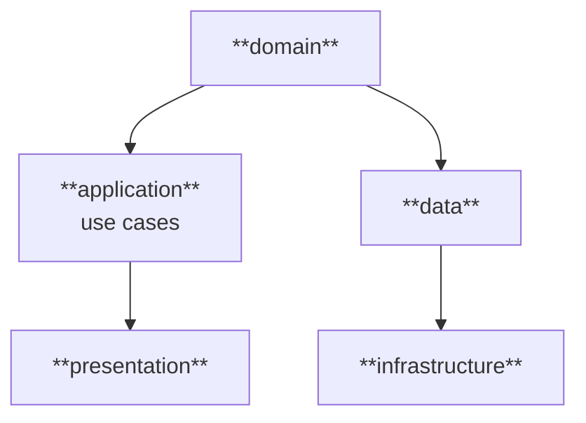

dart run dart_code_linter:metrics analyze lib --reporter=json > clean_arch_metrics.json

# flutter_clean_arch_riverpod

## Arquitetura

Este projeto segue a **Clean Architecture** com influências do **DDD (Domain-Driven Design)**. A estrutura é composta pelas camadas clássicas do DDD, complementadas pelas camadas que o Uncle Bob define como fundamentais no Clean Architecture, e por duas camadas de suporte específicas deste projeto.

### Camadas do DDD

| Camada            | Responsabilidade                                  |
|-------------------|---------------------------------------------------|
| `domain/`         | Regras e contratos de negócio                     |
| `application/`    | Orquestração de regras, contendo os casos de uso  |
| `infrastructure/` | Serviços externos implementados via contratos     |

### Camadas do Clean Architecture

Camadas que o DDD tradicional não explicita, mas o Clean Architecture define como fundamentais:

| Camada       | Responsabilidade                              |
|--------------|-----------------------------------------------|
| `data/`      | Acesso e persistência de dados                |
| `presentation/` | Interface com o usuário e gerenciamento de estado |

### Camadas de Suporte

Camadas transversais específicas deste projeto:

| Camada       | Responsabilidade                               |
|--------------|------------------------------------------------|
| `bootstrap/` | Injeção de dependência (via Riverpod) e rotas  |
| `core/`      | Utilitários transversais                       |

---

## Estrutura de Pastas

```
/lib
├── application/                          # Camada de aplicação: orquestração entre domínio e dados
│   ├── favorites/                           ## Casos de uso de favoritos
│   ├── preferences/                         ## Casos de uso de preferências
│   └── quotes/                              ## Casos de uso de cotações
├── bootstrap/                            # Inicialização e configuração do app
│   ├── di/                                  ## Injeção de dependência (Riverpod)
│   └── routes/                              ## Configuração de rotas (AutoRoute)
├── core/                                 # Utilitários transversais compartilhados entre camadas
│   ├── constants/                           ## Constantes globais
│   ├── failures/                            ## Falhas de domínio, seguindo padrão Result
│   ├── l10n/                                ## Internacionalização
│   └── theme/                               ## Tema e cores da aplicação
├── data/                                 # Camada de dados: implementação de acesso e persistência
│   ├── data_objects/                        ## Objetos de transferência e mapeamento de dados
│   │   ├── *_dao.dart                           ### Mapeamento de persistência local
│   │   └── *_dto.dart                           ### Mapeamento de API REST
│   ├── datasources/                         ## Fontes de dados: API e persistência local
│   │   └── *_datasource.dart
│   └── repositories_impl/                   ## Implementações dos contratos declarados no domínio
│       └── *_repository_impl.dart
├── domain/                               # Camada de domínio: regras e contratos de negócio
│   ├── entities/                            ## Entidades de domínio
│   └── repositories/                        ## Contratos dos repositórios
│       └── *_repository_interface.dart
├── infrastructure/                       # Camada de infraestrutura: serviços externos via contratos
│   ├── api_client/                          ## Cliente HTTP
│   │   ├── dio/                                 ### Implementação com Dio
│   │   ├── models/                              ### Modelos internos (ApiRoute, HttpMethod)
│   │   ├── api_client_failure.dart              ### Falhas da camada HTTP
│   │   └── api_client_interface.dart            ### Contrato do cliente HTTP
│   └── storage/                             ## Persistência local
│       ├── shared_preferences/                  ### Implementação com SharedPreferences
│       ├── storage_failure.dart                 ### Falhas da camada de persistência
│       └── storage_interface.dart               ### Contrato de persistência
└── presentation/                         # Camada de apresentação: UI e gerenciamento de estado
    ├── screens/                             ## Telas
    ├── widgets/                             ## Widgets reutilizáveis
    └── providers/                           ## Gerenciamento de estado (Riverpod)
        ├── *_notifier.dart                      ### Notifiers: lógica de estado
        └── *_state.dart                         ### Estados possíveis da UI
```

## Fluxograma Simplificado


